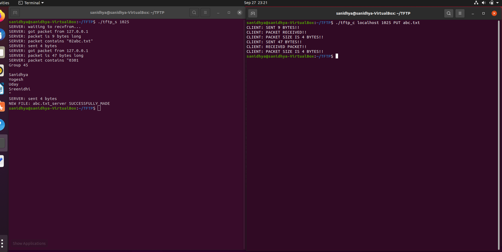
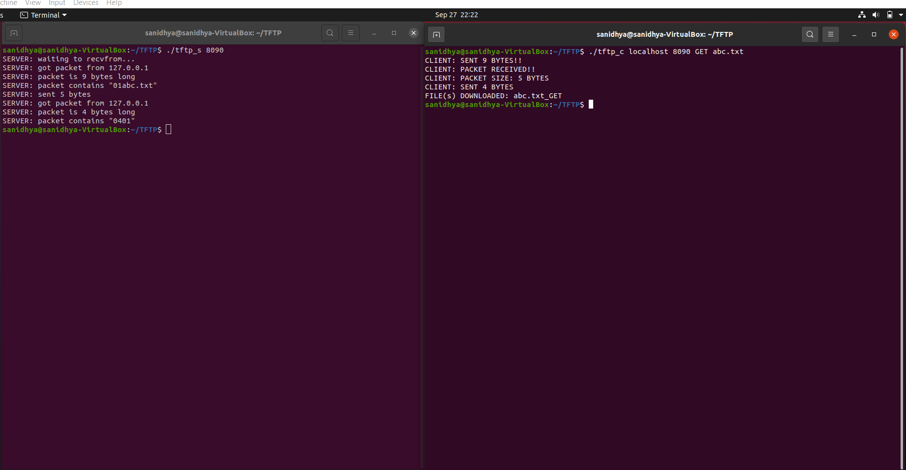
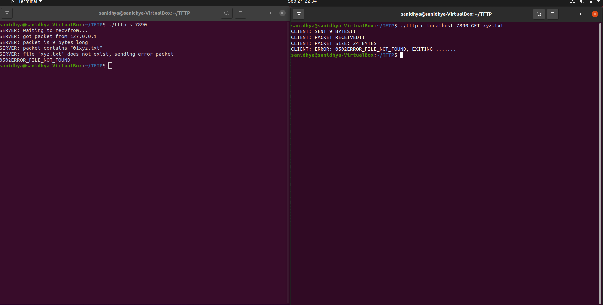
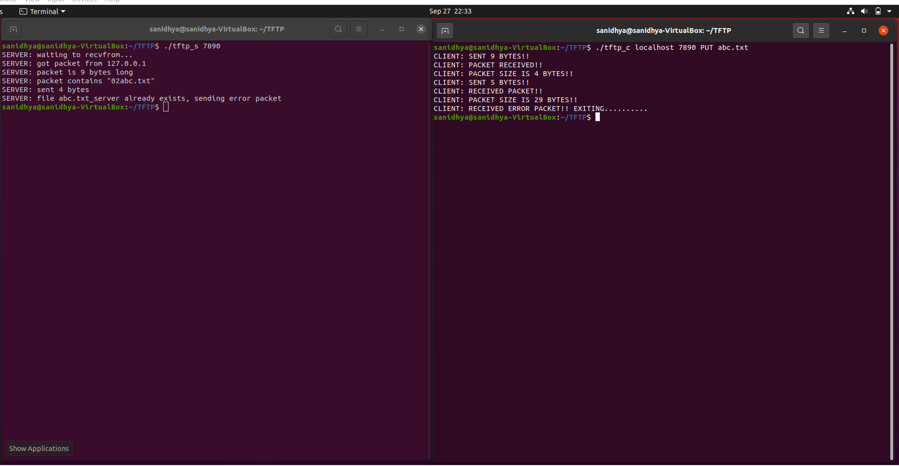
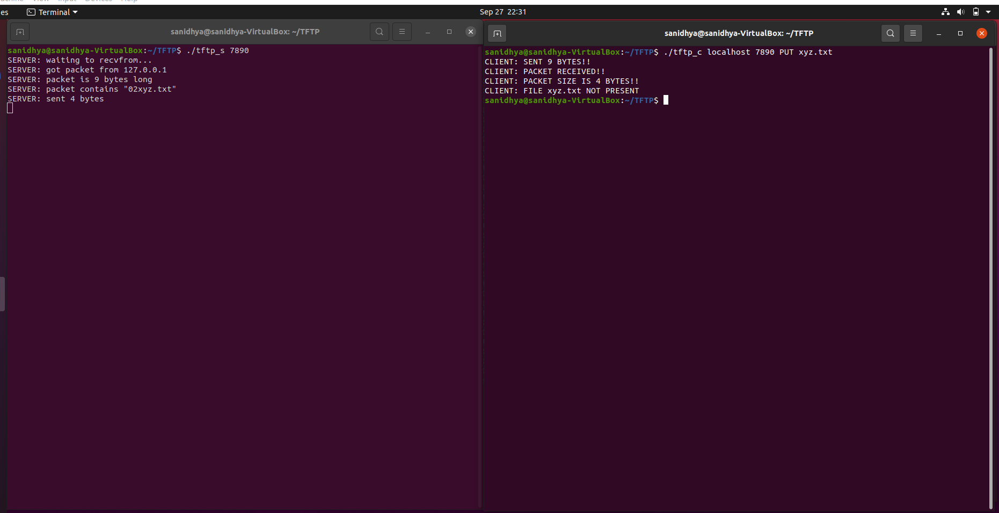

# TFTP
File list:
1. tftp_c.c - TFTP Client Side Implementation.  
2. tftp_s.c - TFTP Server Side Implementation. (Included in the folder just for the purpose of testing!!)  
3. readme.txt.  

Extract the zip file and place all the files(including readme.txt) into a folder named "TFTP".
Move into the "TFTP" folder.

Now tftp_s.c and tftp_c.c is compiled using the following commands.
> gcc tftp_s.c -o tftp_s  
> gcc tftp_c.c -o tftp_c

Setting up the server and client. Open two terminals and move into the TFTP folder in both terminals.

1) In the first terminal, TFTP Server is started before the client.
>./tftp_s ServerPortNo 

  (Make sure that all the port nos. are greater than 1024)

2) In the second terminal, TFTP Client is started after the server is started.
>./tftp_c Server ServerPortNo GET/PUT Filename
  
  (The Server Port Number here must match the server port no above)

GET = TO FETCH FILE FROM SERVER.
PUT = TO SEND FILE TO SERVER.

Different scenarios handled:

1. When correct file is sent using PUT(the file is not already present in the server side)

> ./tftp_s 8090  
> ./tftp_c localhost 8090 PUT abc.txt

  

Newfile, abc.txt_server is created, and the file is transferred from client to server!!

2. When correct file is requested using GET.

> ./tftp_s 8090  
> ./tftp_c localhost 8090 GET abc.txt

  

Newfile, abc.txt_GET is created, and the file is transferred from server to client!!

3. When incorrect file is requested using GET(i.e, the file that is not present in the server)

> ./tftp_s 7890  
> ./tftp_c localhost 7890 GET xyz.txt

  

Error, the client and server side connection is terminated!!

4. When incorrect file is sent using PUT(i.e, the file which is already in server is sent again)

> ./tftp_s 7890  
> ./tftp_c localhost 7890 PUT abc.txt

  

Note if this case is run after case 2, error occurs, else the file is transferred to server and a new file is created!!

5. When incorrect file is sent using PUT(i.e, the file which is not present in client)

> ./tftp_s 7890  
> ./tftp_c localhost 7890 PUT xyz.txt

  

Error, the client and the server side connection is terminated!! 
